# notifyd — Specification (Draft)

## Overview

notifyd is a single-binary daemon that sits on a Linux host, watches for system events, and sends notifications to the places you care about. No dashboard, no database, no web UI — just a YAML config file and a process.

It runs a set of checks — some bundled (CPU, memory, disk, SSH logins, systemd unit failures), some user-defined (any executable that returns a status and key-value output). When a check triggers, it routes a notification through one or more services according to the config. It handles cooldowns, per-alert overrides, and templating so raw scripts don't have to.

**One-liner pitch:** "Monit meets ntfy — a single binary that replaces your scattered cron alert scripts with a config-driven daemon and modern notification providers."

---

## Glossary

| Term            | Definition                                                                                                                                                |
| --------------- | --------------------------------------------------------------------------------------------------------------------------------------------------------- |
| **Check**       | A script/binary that inspects something and returns `status` + key-value output. Reusable. Lives on disk or is fetched via HTTPS.                 |
| **Alert**       | A configured instance of a check. Ties together a check, its arguments, trigger, cooldown, template, and where to send notifications.                     |
| **Notification**| A message sent to a service when an alert triggers.                                                                                                       |
| **Service**     | A configured notification destination. Defined by a Shoutrrr URL with options. Examples: Telegram, Slack, webhook, logger.                                |

**Flow:** A check runs → outputs `status` (ok/warning/critical) + key-value data → if not `ok`, the alert triggers → a notification is rendered from the template → sent to services with merged options.

---

## Configuration

### Config File Location

The daemon looks for config in this order:
1. Explicit flag: `notifyd --config /path/to/config.yaml`
2. User: `~/.config/notifyd/config.yaml`
3. System: `/etc/notifyd/config.yaml`

### File Layout

**System-wide (root):**

```
/usr/bin/notifyd                          # binary
/etc/notifyd/
  config.yaml                             # main config
  checks/                                 # file:// checks
    disk_usage                            # bundled, Cosmopolitan portable binary
    cpu_usage                             # bundled, Cosmopolitan portable binary
    memory_usage                          # bundled, Cosmopolitan portable binary
    ssh_login                             # bundled, Cosmopolitan portable binary
    systemd_unit                          # bundled, Cosmopolitan portable binary
/var/cache/notifyd/                       # https:// cached scripts
    a1b2c3d4e5f6...                       # named by sha256
    f6e5d4c3b2a1...
/var/log/notifyd/
    notifyd.log                           # daemon log
```

**User-local (non-root):**

```
~/.local/bin/notifyd                      # binary
~/.config/notifyd/
  config.yaml
  checks/
~/.cache/notifyd/                         # https:// cached scripts
~/.local/state/notifyd/logs/              # daemon log
```

`notifyd init` places files according to whether it's running as root or not.

---

### Config Structure

```yaml
# Directories — have sensible defaults, user can override
dirs:
  checks: /etc/notifyd/checks         # file:// resolves relative to this
  cache: /var/cache/notifyd            # https:// cached scripts
  logs: /var/log/notifyd               # daemon logs

# Global options
hostname: vps-01                       # optional, defaults to system hostname

# Notification services (Shoutrrr URLs with aliases)
services:
  telegram:
    url: telegram://${TELEGRAM_TOKEN}@telegram
    options:
      chats: ${TELEGRAM_CHAT_ID}
      notification: true
      parsemode: MarkdownV2
      preview: false

  ops-slack:
    url: slack://${SLACK_TOKENS}

  logfile:
    url: logger://

# Alerts
alerts:
  - name: disk_check
    check: file://disk_usage
    trigger:
      interval: 30s
    args:
      threshold_warn: 0.80
      threshold_crit: 0.95
      mount: /
    cooldown:
      warning: 10m
      critical: 1m
      recovery: true
    template: "{{check.status | upper}} {{globals.hostname}}: Disk {{args.mount}} at {{check.usage}}% ({{check.available}} remaining)"
    notify: [telegram, logfile]

  - name: ssl_expiry
    check: https://raw.githubusercontent.com/notifyd/checks/v1.0.0/ssl_check
    sha256: a1b2c3d4e5f6...              # required for https
    trigger:
      interval: 6h
    template: "{{check.status | upper}} {{globals.hostname}}: Certificate for {{check.domain}} expires in {{check.days_left}} days"
    notify: [telegram]

  - name: experimental_check
    check: https://example.com/beta_check.sh
    sha256: false                         # explicit opt-out, re-fetched on daemon start
    trigger:
      interval: 1h
    template: "{{check.status | upper}} {{globals.hostname}}: {{check.message}}"
    notify: [logfile]

  - name: ssh_login
    check: file://ssh_login
    trigger:
      watch: /var/log/auth.log
    timeout: 30s
    args:
      watch: all
      exclude_users: deploy
    template: "{{check.status | upper}} {{globals.hostname}}: SSH login by {{check.user}} from {{check.ip}}"
    notify: [telegram]

  # Per-alert service override with template conditionals
  - name: postgres_down
    check: file://systemd_unit
    trigger:
      interval: 15s
    args:
      units: postgresql
    template: "{{check.status | upper}} {{globals.hostname}}: Unit {{check.unit}} is {{check.state}}"
    notify:
      - logfile
      - ops-slack
      - service: telegram
        options:
          notification: "{{if eq check.status \"warning\"}}false{{else}}true{{end}}"
```

---

## Check URI Schemes

### `file://`

Runs a local executable directly.

- `file://disk_usage` — relative to `dirs.checks`
- `file:///usr/local/bin/my_check.py` — absolute path

Behavior:
- No caching, no downloading. Runs the file directly from disk.
- Daemon verifies the file exists and is executable on startup.
- Fails loud if missing.
- `sha256` is **optional**, defaults to `false`. If set to a hash string, the daemon validates the file's hash before every run and refuses to execute on mismatch.

### `https://`

Fetches a remote script, caches it locally, and runs the cached version.

- `sha256` field is **mandatory** in the config — either a hash string or `false` (explicit opt-out). If missing, the daemon refuses to start and prints:

```
Error: alert "my_check" uses https:// but has no sha256 field.
Add the script's sha256 hash, or set sha256: false to skip verification.
```

#### When `sha256` is a hash string (pinned):

- Cache directory stores files named by their sha256.
- On run: check if hash exists in cache → if yes, run it → if no, download, validate hash, cache, run.
- If download fails and file is cached → run cached version.
- If download fails and not cached → alert errors out.
- Never re-downloads if the hash file already exists in cache.

#### When `sha256: false` (unpinned):

- Script is fetched once per daemon start and cached in memory/temp.
- Re-fetched on `notifyd validate`.
- Pinned scripts survive restarts, unpinned scripts don't.

### `sha256` Summary

| Scheme    | `sha256` field | Default   | Behavior                                          |
| --------- | -------------- | --------- | ------------------------------------------------- |
| `file://`  | optional       | `false`   | If set, validates hash before every run.          |
| `https://` | required       | —         | Hash string: fetch once, cache forever.           |
| `https://` | required       | —         | `false`: fetch once per daemon start, no persist. |

### Check Lifecycle Flowcharts

#### 1. `file://` without sha256 (default)

```yaml
- name: disk_check
  check: file://disk_usage
  trigger:
    interval: 30s
```


#### 2. `file://` with sha256 string

```yaml
- name: disk_check
  check: file://disk_usage
  sha256: b7e4f2c8d1a9...
  trigger:
    interval: 30s
```



```mermaid
flowchart TD
    A[Alert triggered] --> B{File exists at\ndirs.checks/disk_usage ?}
    B -->|No| C[❌ Alert errors out\nLog: file not found]
    B -->|Yes| D{File is executable?}
    D -->|No| E[❌ Alert errors out\nLog: not executable]
    D -->|Yes| F[Compute sha256\nof file on disk]
    F --> G{Hash matches config?}
    G -->|No| H[❌ Alert errors out\nLog: hash mismatch\nfile may have been tampered with]
    G -->|Yes| I[Run check with\nenv vars + stdin]
    I --> J{status\nin output?}
    J -->|Missing| K[⚠️ Log error\nCheck is broken]
    J -->|ok| L[No notification\nMaybe recovery]
    J -->|warning/critical| M[Send notification\nto services]
```

#### 3. `https://` with sha256 string (pinned)

```yaml
- name: ssl_expiry
  check: https://github.com/notifyd/checks/releases/download/v1.0.0/ssl_check
  sha256: a1b2c3d4e5f6...
  trigger:
    interval: 6h
```



```mermaid
flowchart TD
    A[Alert triggered] --> B{File exists in cache as\ndirs.cache/a1b2c3d4e5f6... ?}
    B -->|Yes| F[Run cached check with\nenv vars + stdin]
    B -->|No| C[Attempt HTTPS download]
    C --> D{Download successful?}
    D -->|No| E[❌ Alert errors out\nLog: download failed\nand no cache available]
    D -->|Yes| G[Compute sha256 of\ndownloaded content]
    G --> H{Hash matches config?}
    H -->|No| I[❌ Alert errors out\nLog: hash mismatch\nremote content may have changed]
    H -->|Yes| J[Save to dirs.cache/a1b2c3d4e5f6...\nMark as executable]
    J --> F
    F --> K{status\nin output?}
    K -->|Missing| L[⚠️ Log error\nCheck is broken]
    K -->|ok| M[No notification\nMaybe recovery]
    K -->|warning/critical| N[Send notification\nto services]
```

#### 4. `https://` with sha256: false (unpinned)

```yaml
- name: experimental_check
  check: https://example.com/beta_check.sh
  sha256: false
  trigger:
    interval: 1h
```

**Phase 1: Daemon start / validate**

```mermaid
flowchart TD
    A[Daemon starts or\nnotifyd validate] --> B[Attempt HTTPS download]
    B --> C{Download successful?}
    C -->|Yes| D[Cache check in\nmemory/temp for\nthis session]
    C -->|No| E[⚠️ Log warning:\ndownload failed]
    E --> F{Previous session\ncache exists in temp?}
    F -->|No| G[⚠️ Alert disabled\nfor this session\nLog: no check available]
    F -->|Yes| H[⚠️ Use stale cache\nLog warning]
```



**Phase 2: Alert triggered**


**Phase 3: Daemon stops**


### Bundled Scripts and `notifyd init`

Official check scripts are written in C and compiled with Cosmopolitan Libc into single portable binaries. On `notifyd init`:

1. Official checks are downloaded from the official repository and placed into `dirs.checks` as local files.
2. Cached versions are also placed in `dirs.cache` with their sha256 filenames.
3. Default config is generated referencing the official repo HTTPS URLs with matching sha256 values.

Result: works offline immediately after init. The config references canonical HTTPS URLs but the cache is pre-populated. Since official checks are Cosmopolitan portable binaries, the same URL and sha256 work on any architecture — configs are fully portable across machines.

Official scripts are not a special case. They are distributed via the same `https://` mechanism as any community check. They just happen to live in the official repository (e.g. `github.com/notifyd/checks`) and are pre-cached on init as a convenience.

Example of what `notifyd init` generates:

```yaml
alerts:
  - name: disk_check
    check: https://raw.githubusercontent.com/notifyd/checks/v1.0.0/disk_usage
    sha256: a1b2c3d4e5f6...
    trigger:
      interval: 30s
    args:
      threshold_warn: 0.80
      threshold_crit: 0.95
      mount: /
    cooldown:
      warning: 10m
      critical: 1m
      recovery: true
    template: "{{check.status | upper}} {{globals.hostname}}: Disk {{args.mount}} at {{check.usage}}%"
    notify: [telegram]
```

The user can also change the URI to `file://disk_usage` to use the local copy directly. Both work.

---

## Trigger Types

Each alert must have exactly one trigger. Config validation rejects alerts with multiple triggers or no trigger.

### Interval

Runs the check periodically on a fixed schedule.

```yaml
trigger:
  interval: 30s
```

### Cron

Runs the check on a cron schedule. Uses [robfig/cron](https://github.com/robfig/cron) internally — no system cron involved. Supports standard 5-field and extended 6-field (with seconds) expressions.

```yaml
# Every 5 minutes
trigger:
  cron: "*/5 * * * *"

# Every day at 3am
trigger:
  cron: "0 3 * * *"

# Every Monday at noon
trigger:
  cron: "0 12 * * 1"

# With seconds (6-field): every hour at :30
trigger:
  cron: "0 30 * * * *"
```

`interval` is better for frequent checks ("every 30 seconds"). `cron` is better for scheduled checks ("every day at 3am").

### File Watch

Watches a file for changes using inotify. When new lines are appended, they are piped to the check via stdin.

```yaml
trigger:
  watch: /var/log/auth.log
```

Behavior:
- On daemon start, seeks to the end of the file. Only lines appearing after startup are processed.
- No state is persisted to disk. If the daemon restarts, anything that happened while it was down is missed.
- On normal append: reads new lines from stored offset, pipes to check via stdin, updates offset.
- On log rotation (inode change / `MOVE_SELF`): re-opens the path, resets offset to 0.
- On truncation (file size < stored offset): resets offset to 0, reads from start.
- Multiple new lines are batched into a single check invocation. The check receives all new lines on stdin at once.

---

## Check Interface

### Input

**Environment variables:**

Daemon metadata (set by the daemon):

| Variable | Description | Set for |
|---|---|---|
| `NOTIFYD_TRIGGER` | `"interval"`, `"cron"`, or `"watch"` | always |
| `NOTIFYD_FILE` | Watched file path | watch only |
| `NOTIFYD_LINE_COUNT` | Number of new lines | watch only |

User args (from config `args`, prefixed with `NOTIFYD_ARG_`):

| Config | Environment variable |
|---|---|
| `threshold_warn: 0.80` | `NOTIFYD_ARG_THRESHOLD_WARN=0.80` |
| `mount: /` | `NOTIFYD_ARG_MOUNT=/` |

Arg keys are lowercase in config and templates. Allowed characters: `[a-zA-Z_]`, case-insensitive. The daemon uppercases keys when mapping to environment variables (e.g., `threshold_warn` → `NOTIFYD_ARG_THRESHOLD_WARN`).

**Stdin:**

- For watch triggers: new lines from the watched file, one per line.
- For interval/cron triggers: empty.

### Output

**Format:** `KEY=VALUE` pairs, one per line. Split on first `=` only. Lines without `=` are ignored.

**Reserved keys (NOTIFYD_ prefix):**

| Key | Required | Values | Description |
|---|---|---|---|
| `status` | **yes** | `ok`, `warning`, `critical` | The check result. Drives notifications and cooldown. |

If `status` is missing from output, the check is considered broken — logged as error, never triggers a notification.

| `status` | Meaning | Notification? |
|---|---|---|
| `ok` | No problem | Only if recovery enabled |
| `warning` | Problem, needs attention | Yes |
| `critical` | Urgent problem | Yes |
| (missing) | Check is broken | Log error, never notify |

**Check-specific keys (no prefix, user-defined):**

```
status=warning
usage=84
available=8G
```

### Check Types

A check is any executable file. The daemon does not care about the language or runtime — it executes the file and reads stdout.

**Official bundled checks** are written in C and compiled with [Cosmopolitan Libc](https://github.com/jart/cosmopolitan) into Actually Portable Executables. Each check is a single binary that runs on any architecture (x86_64, aarch64) and any Linux distribution. They use direct syscalls (`statvfs()`, `/proc/stat`, `/proc/meminfo`, etc.) with zero external dependencies — no `df`, no `awk`, no runtime needed. This means one binary per check, one URL, one sha256, and the same config works across machines regardless of architecture.

**Community and user checks** can be anything: Go, Rust, Python, Node.js, Bash, C — whatever the user has on their system. Shell scripts are supported but not recommended for shared checks due to portability concerns (reliance on `awk`, `df`, `bc`, etc. varying across distributions). Cosmopolitan C is recommended for checks intended to be distributed.

The daemon treats all checks identically. The distinction between bundled and user checks only matters at distribution time.

### Technology Stack

| Layer                  | Language              | Why                                            |
| ---------------------- | --------------------- | ---------------------------------------------- |
| Daemon (`notifyd`)     | Go                    | Shoutrrr, fsnotify, robfig/cron, Sprig        |
| Official checks        | C (Cosmopolitan Libc) | Portable single binary, direct syscalls        |
| User/community checks  | Anything              | User's choice and responsibility               |

### Documenting Check Interfaces

Each check (official or community) should document its arguments, outputs, and status logic. Example for the official `disk_usage` check:

```
disk_usage

Arguments (config → env):
  threshold_warn  → NOTIFYD_ARG_THRESHOLD_WARN  - percentage as float for warning
  threshold_crit  → NOTIFYD_ARG_THRESHOLD_CRIT  - percentage as float for critical
  mount           → NOTIFYD_ARG_MOUNT           - mount point to check

Outputs:
  status    - "ok", "warning", or "critical"
  usage           - percentage as integer
  available       - remaining space

Status logic:
  usage >= NOTIFYD_ARG_THRESHOLD_CRIT → status=critical
  usage >= NOTIFYD_ARG_THRESHOLD_WARN → status=warning
  otherwise                           → status=ok
```

This tells the user exactly what to put in `args`, what `{{check.*}}` variables are available for templates, and what status values to expect for cooldown configuration.

### Example: bundled checks (Cosmopolitan C, single portable binary each)

```
checks/
  disk_usage          # runs on any arch
  cpu_usage           # runs on any arch
  memory_usage        # runs on any arch
  ssh_login           # runs on any arch, reads stdin lines
  systemd_unit        # runs on any arch
```

### Example: user checks (any executable)

```
checks/
  my_custom_check.sh      # bash
  ssl_verify.py           # python
  api_health              # compiled Go/Rust/C
```

### Example: interval check invocation

```
NOTIFYD_TRIGGER=interval NOTIFYD_ARG_THRESHOLD_WARN=0.80 NOTIFYD_ARG_MOUNT=/ /etc/notifyd/checks/disk_usage
```

### Example: watch check invocation

```
NOTIFYD_TRIGGER=watch NOTIFYD_FILE=/var/log/auth.log NOTIFYD_LINE_COUNT=3 NOTIFYD_ARG_WATCH=all NOTIFYD_ARG_EXCLUDE_USERS=deploy /etc/notifyd/checks/ssh_login <<< "line1\nline2\nline3"
```

---

## Timeout and Concurrent Execution

### Timeout

An optional `timeout` field can be set per alert. If a check exceeds the timeout, the process is killed.

```yaml
- name: disk_check
  trigger:
    interval: 30s
  timeout: 10s              # optional
```

If not set, no timeout — the check runs as long as it wants.

### Concurrent Execution

Concurrency is tracked **per alert name**, not per check script. Two alerts using the same check with different args are independent.

| Trigger | Behavior when previous check still running |
|---|---|
| `interval` / `cron` | Kill previous process, start new invocation |
| `watch` | Buffer new lines, run after previous completes. If previous exceeds `timeout`, kill it and flush buffer into new invocation |

For watch triggers, there is no queue — just a single line buffer. New lines keep appending to the buffer while a check is running. When the current check finishes (or is killed by timeout), all buffered lines are flushed into the next invocation.

---

## Cooldown

Cooldown suppresses repeated notifications for the same status. Each status (`warning`, `critical`) has its own independent timer. Checks always run regardless of cooldown state — cooldown only affects whether a notification is sent.

### Config

```yaml
# Simple — same cooldown for all statuses
cooldown: 5m

# Per-status — independent timers
cooldown:
  warning: 10m
  critical: 1m
  recovery: true       # default: false
```

When `cooldown: 5m` (simple form), it's shorthand for the same value applied to each status independently.

### Behavior

- Each status (`warning`, `critical`) has its own independent cooldown timer.
- When a check returns `warning`/`critical` and that status's cooldown is not active: send notification, start cooldown timer.
- When a check returns `warning`/`critical` and that status's cooldown is active: suppress notification.
- When a check returns `ok` after any previous `warning`/`critical` and `recovery: true`: send recovery notification, reset all cooldown timers.
- When a check returns `ok` after any previous `warning`/`critical` and `recovery: false`: no notification, reset all cooldown timers.
- When a check returns `ok` and previous result was also `ok`: nothing.
- If `status` is missing (broken check): logged as error, does not trigger cooldown.
- If the check outputs a status that has no matching cooldown key, it falls back to the simple `cooldown` value. If neither exists, no cooldown.

### Example Timeline

```
cooldown:
  warning: 10m
  critical: 1m
  recovery: true

t=0:00  check → ok       → nothing (no previous alert)
t=0:30  check → warning  → notify, start cooldown(warning, 10m)
t=1:00  check → warning  → suppress (warning cooldown active)
t=1:30  check → critical → notify (critical has its own timer), start cooldown(critical, 1m)
t=2:00  check → critical → suppress (critical cooldown active)
t=2:30  check → critical → notify (critical cooldown expired), restart cooldown
t=3:00  check → ok       → notify recovery, reset all cooldowns
t=3:30  check → ok       → nothing (already recovered)
t=4:00  check → warning  → notify (cooldowns were reset, fresh incident)
```

---

## CLI Commands

### `notifyd init`

Generates default config if it doesn't exist, then runs `notifyd validate`.

- Detects root vs non-root and places files accordingly (`/etc/notifyd/` vs `~/.config/notifyd/`).
- Downloads official checks from the official repository and pre-populates the cache.
- Does nothing if config already exists (will not overwrite).

### `notifyd start`

Runs `notifyd validate` first, then starts the daemon in the foreground. Reads config, starts all alert intervals and file watchers, runs until interrupted.

**Signal handling:**
- **SIGINT** (Ctrl+C) — graceful shutdown. Finishes any currently running checks, then exits.
- **SIGTERM** (systemd stop) — graceful shutdown. Same behavior as SIGINT.
- **SIGHUP** — triggers `validate` logic: re-reads config, re-fetches unpinned `https://` checks. If validation fails, the reload is rejected and the daemon continues with the previous config.

### `notifyd validate`

Validates and syncs the current config:

- Validates YAML syntax.
- Verifies all services have valid Shoutrrr URLs.
- Verifies all `file://` checks exist and are executable.
- Verifies all `sha256` hashes match.
- Fetches/re-fetches all `https://` checks (pinned: only if not cached; unpinned: always).
- Reports errors and exits non-zero if anything fails.

Used automatically by `notifyd init` and `notifyd start`. Can be run standalone for CI/deploy pipelines.

### `notifyd run <alert_name>`

Manually triggers a specific alert once. Runs the check, renders the template, and sends notifications to configured services. Ignores the trigger type — just executes the check immediately.

For checks that expect stdin (file watch checks), pipe input manually:

```
$ echo "some log line" | notifyd run ssh_login
```

```
$ notifyd run disk_check
✓ Check: file://disk_usage
  Output:
    status=warning
    usage=84
    total=50G
    available=8G
  Rendered: "WARNING vps-01: Disk / at 84% (8G remaining)"
  Notified: telegram, logfile
```

Use `--dry-run` to skip sending notifications:

```
$ notifyd run disk_check --dry-run
✓ Check: file://disk_usage
  Output:
    status=warning
    usage=84
    total=50G
    available=8G
  Rendered: "WARNING vps-01: Disk / at 84% (8G remaining)"
  Would notify: telegram, logfile
```

This allows notifyd to be used as a standalone one-shot tool (e.g. from cron) without running the daemon.

### `notifyd hash <file>`

Prints the sha256 hash of a file. Convenience for users adding pinned checks to their config.

```
$ notifyd hash checks/disk_usage
a1b2c3d4e5f6789...
```

---

## Notification Templates

Alert templates define the message body sent to services. Templates are Go [`text/template`](https://pkg.go.dev/text/template) strings with [Sprig](https://masterminds.github.io/sprig/) functions, resolved at notification time when the check has run.

```yaml
template: "{{check.status | upper}} {{globals.hostname}}: Disk {{args.mount}} at {{check.usage}}%"
```

**Available template variables:**

| Variable | Source |
|---|---|
| `{{globals.hostname}}` | Global `hostname` or system hostname |
| `{{alert.name}}` | Alert's `name` field |
| `{{check.*}}` | All key-value pairs from check stdout (including `{{check.status}}`) |
| `{{check.status_emoji}}` | Derived from `check.status`: 🔴 critical, 🟡 warning, 🟢 ok |
| `{{args.*}}` | Args from alert config |

All check output values are strings. Use `atoi` or `float64` for numeric operations.

`check.status_emoji` is a **derived variable** — computed by the daemon from `check.status`, not from check output. A check cannot override it.

**Sprig functions are available for advanced formatting:**

```yaml
# String manipulation
template: "{{check.status | upper}} on {{globals.hostname}}"                   # "WARNING on vps-01"

# Conditionals
template: >
  {{check.status_emoji}}
  {{globals.hostname}}: Disk at {{check.usage}}%

# Math
template: "{{check.available_bytes | float64 | div 1073741824 | printf \"%.1f\"}}GB remaining"

# Default values
template: "{{args.mount | default \"/\"}}"

# Date/time
template: "{{now | date \"15:04\"}} {{check.status | upper}} {{globals.hostname}}"
```

See [Sprig documentation](https://masterminds.github.io/sprig/) for the full list of available functions.

`template` is a required field. Each check defines its own output keys, so a meaningful template must be written per alert.

### Per-Service Template Overrides

The top-level `template` is the default message body for all services. Individual services can override it in the `notify` list, along with any Shoutrrr options:

```yaml
alerts:
  - name: disk_check
    check: file://disk_usage
    trigger:
      interval: 30s
    args:
      threshold_warn: 0.80
      threshold_crit: 0.95
      mount: /
    cooldown:
      warning: 10m
      critical: 1m
    template: "{{check.status | upper}} {{globals.hostname}}: Disk {{args.mount}} at {{check.usage}}%"
    notify:
      - logfile
      - ops-slack
      - service: telegram
        template: "*{{check.status | upper}}* `{{globals.hostname}}`: Disk {{args.mount}} at {{check.usage}}%"
        options:
          parsemode: MarkdownV2
          notification: "{{if eq check.status \"warning\"}}false{{else}}true{{end}}"
      - service: email
        template: "Disk {{args.mount}} is at {{check.usage}}%\n\nHost: {{globals.hostname}}\nAvailable: {{check.available}}"
        options:
          subject: "[{{check.status | upper}}] {{globals.hostname}}: {{alert.name}}"
```

**Template resolution:** alert.notify[].template → alert.template

`{{...}}` variables work inside Shoutrrr options values too (e.g. `subject`, `notification`).

---

## Variable Interpolation

The config uses two distinct variable syntaxes resolved at different times:

**`${...}` — environment variables, resolved at config parse time.**

Uses [envsubst](https://github.com/a8m/envsubst) to substitute system environment variables when the YAML is loaded. Used for secrets and deployment-specific values.

```yaml
services:
  telegram:
    url: telegram://${TELEGRAM_TOKEN}@telegram
    options:
      chats: ${TELEGRAM_CHAT_ID}
```

**`{{...}}` — template variables, resolved at notification time.**

Populated from globals, alert config, and check output when a notification is sent.

```yaml
alerts:
  - name: disk_check
    template: "{{check.status | upper}} {{globals.hostname}}: Disk {{args.mount}} at {{check.usage}}%"
```

---

## Service Options

Service options map directly to Shoutrrr query params for each service type. Options can be overridden per alert.

**Resolution order (later overrides earlier):**

```
service.options              ← base Shoutrrr params
alert.notify[].options       ← override for this specific alert
```

**Simple notify (service defaults):**

```yaml
notify: [telegram, logfile]
```

**Per-alert service override:**

```yaml
notify:
  - logfile
  - service: telegram
    options:
      notification: true     # override telegram's default for this alert
```

Options values support `{{...}}` template variables for dynamic behavior based on check output.

---

## Notification Delivery

Built on top of [Shoutrrr](https://containrrr.dev/shoutrrr/). Any Shoutrrr-supported service works as a notification destination.

Supported services include: Telegram, Discord, Slack, Email (SMTP), Gotify, Google Chat, IFTTT, Mattermost, Matrix, Ntfy, OpsGenie, Pushbullet, Pushover, Rocketchat, Teams, Zulip, generic webhooks, and the built-in logger.

The daemon's responsibility is:
- **Routing:** which services to notify, based on alert config.
- **Option merging:** resolve service base options → alert-level overrides into a final set of Shoutrrr params.
- **Spam prevention:** cooldown logic per alert and status.
- **Templating:** resolve `{{...}}` variables into the final message body and option values.

Shoutrrr handles the actual delivery. The daemon does not interpret service options — it passes the merged key-value pairs directly to Shoutrrr.

---

## Language

- **Daemon:** Go. Key dependencies: Shoutrrr (notification delivery), fsnotify (file watching), robfig/cron (cron scheduling), Sprig (template functions), envsubst (env var interpolation).
- **Official checks:** C compiled with Cosmopolitan Libc. Produces single portable binaries that run on any Linux architecture. Direct syscalls for system metrics, zero external dependencies.
- **User checks:** Any language. The daemon executes any file with the executable bit set.