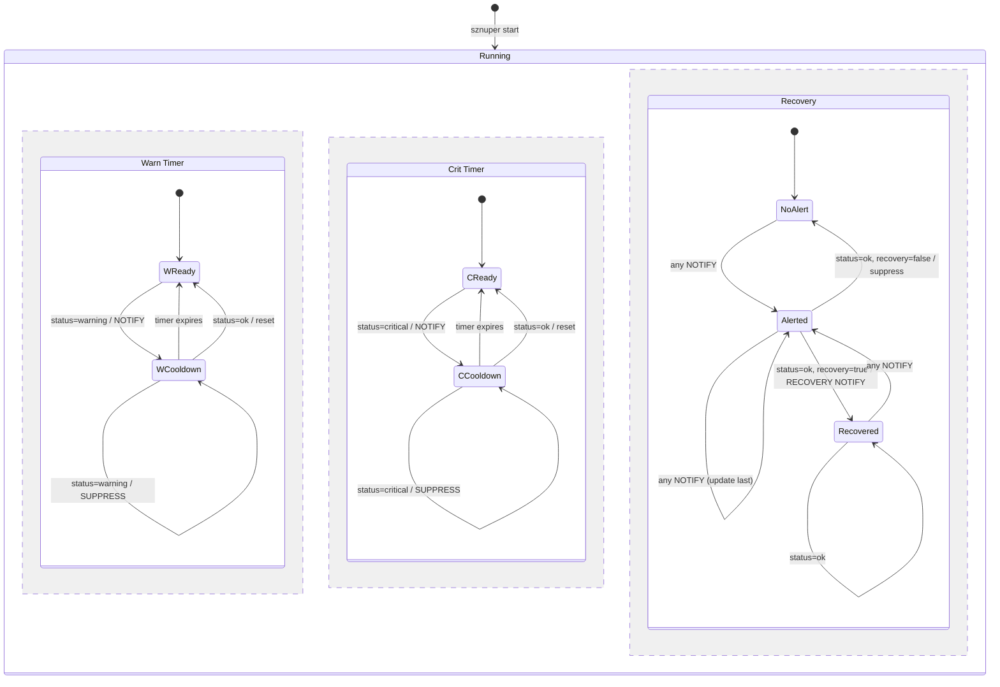

# sznuper — Cooldown

Cooldown suppresses repeated notifications for the same status. Each status (`warning`, `critical`) has its own independent timer. Healthchecks always run regardless of cooldown state — cooldown only affects whether a notification is sent.

## Config

```yaml
# Disabled — notify every tick (default, omit cooldown entirely or set to "0")
cooldown: "0"

# Simple — same cooldown for both statuses
cooldown: 5m

# Infinite — notify once per incident, reset only on ok
cooldown: inf

# Per-status — independent timers
cooldown:
  warning: 10m
  critical: 1m
  recovery: true       # default: false
```

Valid values for `warning`, `critical`, and the simple form:

| Value | Meaning |
|---|---|
| omitted / `"0"` / `"0s"` | No cooldown — notify every tick |
| `"5m"`, `"30s"`, `"1h"` | Suppress for that duration after a notification |
| `"inf"` | Suppress until `ok` resets the cycle (notify once per incident) |

`cooldown: 5m` is shorthand for `cooldown: { warning: 5m, critical: 5m }`. `recovery` defaults to `false`.

## State Machine

Three regions run in parallel per alert. Warning and critical timers are fully independent — receiving `warning` does not affect the critical timer and vice versa. Only `status=ok` resets both.



`inf` cooldown: the timer never expires on its own — `WCooldown` and `CCooldown` have no timer-expiry transition. Only `status=ok` resets them.

## Behavior

- Each status (`warning`, `critical`) has its own independent cooldown timer.
- When a healthcheck returns `warning`/`critical` and that status's cooldown is not active: send notification, start cooldown timer.
- When a healthcheck returns `warning`/`critical` and that status's cooldown is active: suppress notification, no state change.
- Alternating between `warning` and `critical` does not reset either timer — each status only resets on its own timer expiry or on `ok`.
- When a healthcheck returns `ok` after any previous `warning`/`critical` and `recovery: true`: send recovery notification, reset all cooldown timers.
- When a healthcheck returns `ok` after any previous `warning`/`critical` and `recovery: false`: no notification, reset all cooldown timers.
- When a healthcheck returns `ok` and previous result was also `ok`: nothing.
- If `status` is missing (broken healthcheck): logged as error, does not trigger cooldown.

## Example Timelines

### Time-based cooldown

```
cooldown:
  warning: 10m
  critical: 1m
  recovery: true

t=0:00  status → ok       → nothing (no previous alert)
t=0:30  status → warning  → NOTIFY, start cooldown(warning, 10m)
t=1:00  status → warning  → suppress (warning cooldown active)
t=1:30  status → critical → NOTIFY (independent timer), start cooldown(critical, 1m)
t=2:00  status → critical → suppress (critical cooldown active)
t=2:30  status → critical → NOTIFY (critical cooldown expired), restart cooldown(critical, 1m)
t=2:45  status → warning  → suppress (warning cooldown still active until t=10:30)
t=3:00  status → ok       → RECOVERY NOTIFY, reset all cooldowns
t=3:30  status → ok       → nothing (already recovered)
t=4:00  status → warning  → NOTIFY (cooldowns were reset, fresh incident)
```

### Infinite cooldown

```
cooldown:
  warning: inf
  critical: inf
  recovery: true

t=0:00  status → warning  → NOTIFY
t=5:00  status → warning  → suppress (infinite, never expires on its own)
t=9:00  status → critical → NOTIFY (critical timer was never started)
t=12:00 status → critical → suppress
t=15:00 status → ok       → RECOVERY NOTIFY, reset all cooldowns
t=20:00 status → warning  → NOTIFY (cooldowns were reset)
```
