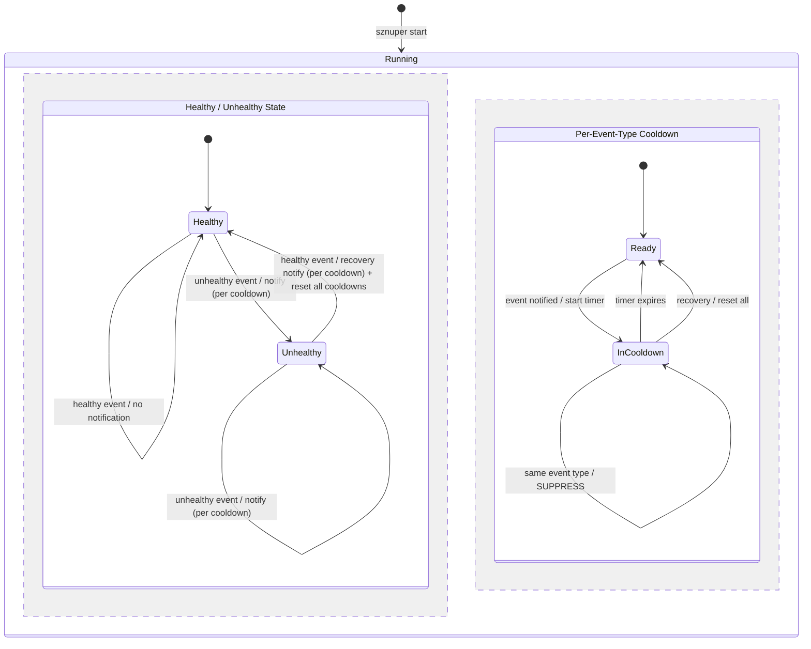

# sznuper — Cooldown

Cooldown suppresses repeated notifications for the same event type. Each event type has its own independent timer. Healthchecks always run regardless of cooldown state — cooldown only affects whether a notification is sent.

## Config

```yaml
# Disabled — notify every time (default, omit cooldown entirely or set to "0")
cooldown: "0"

# Simple — same cooldown for all event types
cooldown: 5m

# Infinite — notify once per incident, reset only on recovery
cooldown: inf

# Per-event-type — via events.override
cooldown: 10m
events:
  healthy: [ok]
  override:
    high_usage:
      cooldown: 10m
    critical_usage:
      cooldown: 1m
```

Valid values for cooldown:

| Value | Meaning |
|---|---|
| omitted / `"0"` / `"0s"` | No cooldown — notify every time |
| `"5m"`, `"30s"`, `"1h"` | Suppress for that duration after a notification |
| `"inf"` | Suppress until recovery resets the cycle (notify once per incident) |

Per-event-type cooldown is specified in `events.override.<type>.cooldown`. If not specified for a given event type, the alert-level `cooldown` is used as default.

## State Machine

When `events.healthy` is defined, sznuper maintains a binary healthy/unhealthy state per alert. Cooldown timers are per-event-type and fully independent.



`inf` cooldown: the timer never expires on its own — only recovery resets it.

## Behavior

- Each event type has its own independent cooldown timer.
- When an event fires and cooldown is not active for that type: send notification, start cooldown timer.
- When an event fires and cooldown is active for that type: suppress notification, no state change.
- When a healthy event arrives while in unhealthy state (recovery): send recovery notification (subject to cooldown), reset all cooldown timers.
- When a healthy event arrives while already healthy: no notification.
- Recovery resets all cooldown timers, so the next unhealthy event after recovery always fires.

### Without State Machine

When `events.healthy` is not defined:
- No state tracking. No recovery concept.
- Every event is processed and notified independently (subject to cooldown).
- This is the simpler mode, suitable for pipe/watch triggers where events are inherently noteworthy.

## Example Timelines

### Time-based cooldown

```
cooldown: 10m
events:
  healthy: [ok]
  override:
    critical_usage:
      cooldown: 1m

t=0:00  type → ok             → nothing (already healthy)
t=0:30  type → high_usage     → NOTIFY, start cooldown(high_usage, 10m)
t=1:00  type → high_usage     → suppress (high_usage cooldown active)
t=1:30  type → critical_usage → NOTIFY (independent timer), start cooldown(critical_usage, 1m)
t=2:00  type → critical_usage → suppress (critical_usage cooldown active)
t=2:30  type → critical_usage → NOTIFY (critical_usage cooldown expired), restart cooldown(critical_usage, 1m)
t=2:45  type → high_usage     → suppress (high_usage cooldown still active until t=10:30)
t=3:00  type → ok             → RECOVERY NOTIFY, reset all cooldowns
t=3:30  type → ok             → nothing (already healthy)
t=4:00  type → high_usage     → NOTIFY (cooldowns were reset, fresh incident)
```

### Infinite cooldown

```
cooldown: inf
events:
  healthy: [ok]

t=0:00  type → high_usage     → NOTIFY
t=5:00  type → high_usage     → suppress (infinite, never expires on its own)
t=9:00  type → critical_usage → NOTIFY (critical_usage timer was never started)
t=12:00 type → critical_usage → suppress
t=15:00 type → ok             → RECOVERY NOTIFY, reset all cooldowns
t=20:00 type → high_usage     → NOTIFY (cooldowns were reset)
```
