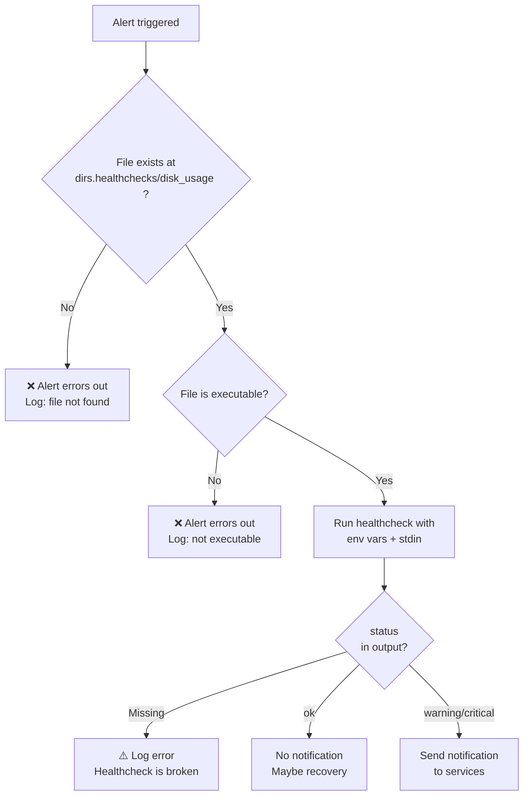
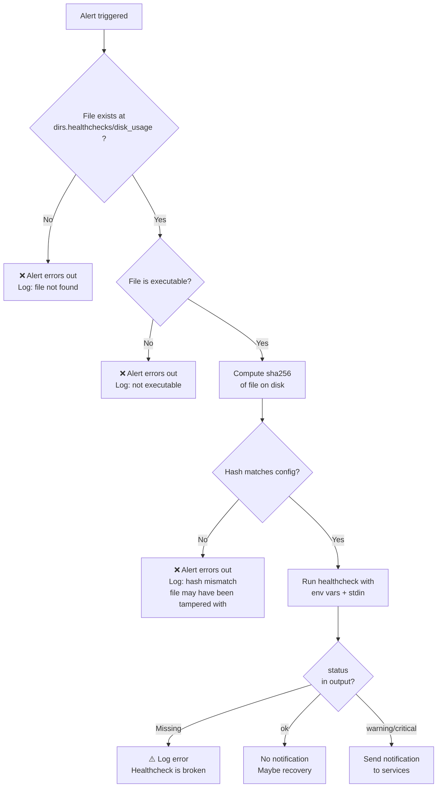
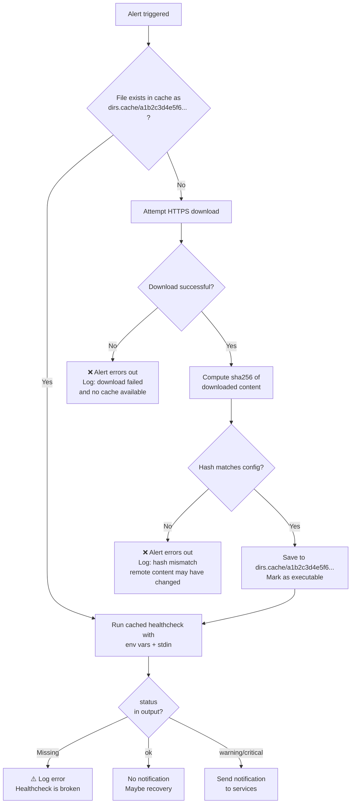
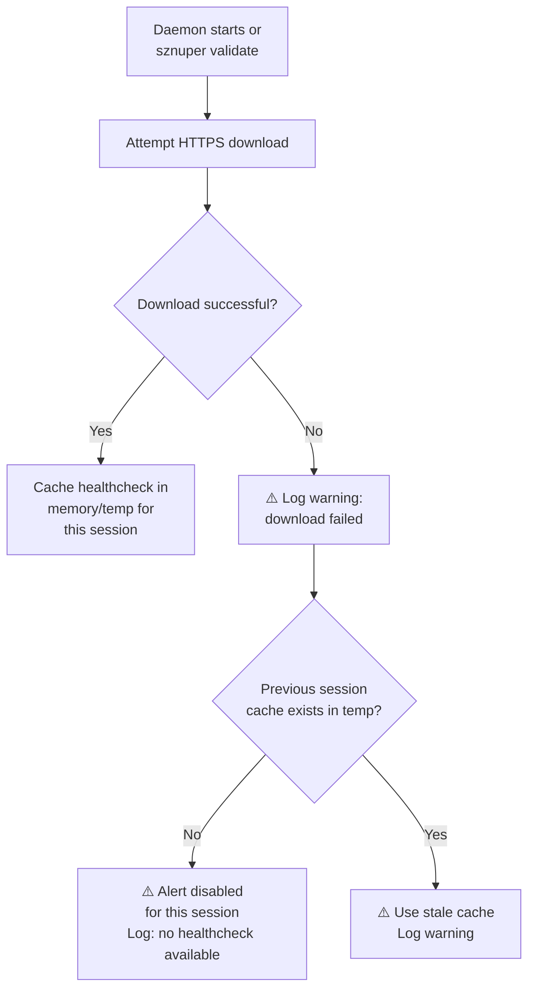
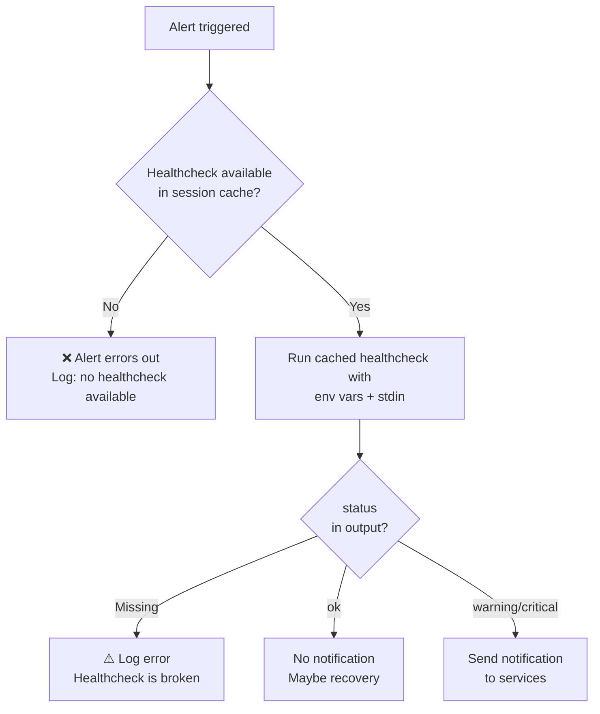

# sznuper — Healthchecks

## Healthcheck URI Schemes

### `file://`

Runs a local executable directly.

- `file://disk_usage` — relative to `dirs.healthchecks`
- `file:///usr/local/bin/my_check.py` — absolute path

Behavior:
- No caching, no downloading. Runs the file directly from disk.
- Daemon verifies the file exists and is executable on startup.
- Fails loud if missing.
- `sha256` is **optional**, defaults to `false`. If set to a hash string, the daemon validates the file's hash before every run and refuses to execute on mismatch.

### `https://`

Fetches a remote script, caches it locally, and runs the cached version.

- `sha256` field is **mandatory** in the config — either a hash string or `false` (explicit opt-out). If missing, the daemon refuses to start and prints:

```
Error: alert "my_check" uses https:// but has no sha256 field.
Add the script's sha256 hash, or set sha256: false to skip verification.
```

#### When `sha256` is a hash string (pinned):

- Cache directory stores files named by their sha256.
- On run: check if hash exists in cache → if yes, run it → if no, download, validate hash, cache, run.
- If download fails and file is cached → run cached version.
- If download fails and not cached → alert errors out.
- Never re-downloads if the hash file already exists in cache.

#### When `sha256: false` (unpinned):

- Script is fetched once per daemon start and cached in memory/temp.
- Re-fetched on `sznuper validate`.
- Pinned scripts survive restarts, unpinned scripts don't.

### `sha256` Summary

| Scheme    | `sha256` field | Default   | Behavior                                          |
| --------- | -------------- | --------- | ------------------------------------------------- |
| `file://`  | optional       | `false`   | If set, validates hash before every run.          |
| `https://` | required       | —         | Hash string: fetch once, cache forever.           |
| `https://` | required       | —         | `false`: fetch once per daemon start, no persist. |

### Healthcheck Lifecycle Flowcharts

#### 1. `file://` without sha256 (default)

```yaml
- name: disk_check
  healthcheck: file://disk_usage
  trigger:
    interval: 30s
```



#### 2. `file://` with sha256 string

```yaml
- name: disk_check
  healthcheck: file://disk_usage
  sha256: b7e4f2c8d1a9...
  trigger:
    interval: 30s
```



#### 3. `https://` with sha256 string (pinned)

```yaml
- name: ssl_expiry
  healthcheck: https://github.com/sznuper/healthchecks/releases/download/v1.0.0/ssl_check
  sha256: a1b2c3d4e5f6...
  trigger:
    interval: 6h
```



#### 4. `https://` with sha256: false (unpinned)

```yaml
- name: experimental_check
  healthcheck: https://example.com/beta_check.sh
  sha256: false
  trigger:
    interval: 1h
```

**Phase 1: Daemon start / validate**



**Phase 2: Alert triggered**



**Phase 3: Daemon stops**


### Bundled Scripts and `sznuper init`

Official healthcheck scripts are written in C and compiled with Cosmopolitan Libc into single portable binaries. On `sznuper init`:

1. Official healthchecks are downloaded from the official repository and placed into `dirs.healthchecks` as local files.
2. Cached versions are also placed in `dirs.cache` with their sha256 filenames.
3. Default config is generated referencing the official repo HTTPS URLs with matching sha256 values.

Result: works offline immediately after init. The config references canonical HTTPS URLs but the cache is pre-populated. Since official healthchecks are Cosmopolitan portable binaries, the same URL and sha256 work on any architecture — configs are fully portable across machines.

Official scripts are not a special case. They are distributed via the same `https://` mechanism as any community healthcheck. They just happen to live in the official repository (e.g. `github.com/sznuper/healthchecks`) and are pre-cached on init as a convenience.

Example of what `sznuper init` generates:

```yaml
alerts:
  - name: disk_check
    healthcheck: https://raw.githubusercontent.com/sznuper/healthchecks/v1.0.0/disk_usage
    sha256: a1b2c3d4e5f6...
    trigger:
      interval: 30s
    args:
      threshold_warn: 0.80
      threshold_crit: 0.95
      mount: /
    cooldown:
      warning: 10m
      critical: 1m
      recovery: true
    template: "{{healthcheck.status | upper}} {{globals.hostname}}: Disk {{args.mount}} at {{healthcheck.usage}}%"
    notify: [telegram]
```

The user can also change the URI to `file://disk_usage` to use the local copy directly. Both work.

---

## Healthcheck Interface

### Input

**Environment variables:**

Daemon metadata (set by the daemon):

| Variable | Description | Set for |
|---|---|---|
| `HEALTHCHECK_TRIGGER` | `"interval"`, `"cron"`, or `"watch"` | always |
| `HEALTHCHECK_FILE` | Watched file path | watch only |
| `HEALTHCHECK_LINE_COUNT` | Number of new lines | watch only |

User args (from config `args`, prefixed with `HEALTHCHECK_ARG_`):

| Config | Environment variable |
|---|---|
| `threshold_warn: 0.80` | `HEALTHCHECK_ARG_THRESHOLD_WARN=0.80` |
| `mount: /` | `HEALTHCHECK_ARG_MOUNT=/` |

Arg keys are lowercase in config and templates. Allowed characters: `[a-zA-Z_]`, case-insensitive. The daemon uppercases keys when mapping to environment variables (e.g., `threshold_warn` → `HEALTHCHECK_ARG_THRESHOLD_WARN`).

**Stdin:**

- For watch triggers: new lines from the watched file, one per line.
- For interval/cron triggers: empty.

### Output

**Format:** `KEY=VALUE` pairs, one per line. Split on first `=` only. Lines without `=` are ignored.

**Reserved keys (HEALTHCHECK_ prefix):**

| Key | Required | Values | Description |
|---|---|---|---|
| `status` | **yes** | `ok`, `warning`, `critical` | The healthcheck result. Drives notifications and cooldown. |

If `status` is missing from output, the healthcheck is considered broken — logged as error, never triggers a notification.

| `status` | Meaning | Notification? |
|---|---|---|
| `ok` | No problem | Only if recovery enabled |
| `warning` | Problem, needs attention | Yes |
| `critical` | Urgent problem | Yes |
| (missing) | Healthcheck is broken | Log error, never notify |

**Healthcheck-specific keys (no prefix, user-defined):**

```
status=warning
usage=84
available=8G
```

### Healthcheck Types

A healthcheck is any executable file. The daemon does not care about the language or runtime — it executes the file and reads stdout.

**Official bundled healthchecks** are written in C and compiled with [Cosmopolitan Libc](https://github.com/jart/cosmopolitan) into Actually Portable Executables. Each healthcheck is a single binary that runs on any architecture (x86_64, aarch64) and any Linux distribution. They use direct syscalls (`statvfs()`, `/proc/stat`, `/proc/meminfo`, etc.) with zero external dependencies — no `df`, no `awk`, no runtime needed. This means one binary per healthcheck, one URL, one sha256, and the same config works across machines regardless of architecture.

**Community and user healthchecks** can be anything: Go, Rust, Python, Node.js, Bash, C — whatever the user has on their system. Shell scripts are supported but not recommended for shared healthchecks due to portability concerns (reliance on `awk`, `df`, `bc`, etc. varying across distributions). Cosmopolitan C is recommended for healthchecks intended to be distributed.

The daemon treats all healthchecks identically. The distinction between bundled and user healthchecks only matters at distribution time.

### Technology Stack

| Layer                  | Language              | Why                                            |
| ---------------------- | --------------------- | ---------------------------------------------- |
| Daemon (`sznuper`)     | Go                    | Shoutrrr, fsnotify, robfig/cron, Sprig        |
| Official healthchecks   | C (Cosmopolitan Libc) | Portable single binary, direct syscalls        |
| User/community healthchecks | Anything          | User's choice and responsibility               |

### Documenting Healthcheck Interfaces

Each healthcheck (official or community) should document its arguments, outputs, and status logic. Example for the official `disk_usage` healthcheck:

```
disk_usage

Arguments (config → env):
  threshold_warn  → HEALTHCHECK_ARG_THRESHOLD_WARN  - percentage as float for warning
  threshold_crit  → HEALTHCHECK_ARG_THRESHOLD_CRIT  - percentage as float for critical
  mount           → HEALTHCHECK_ARG_MOUNT           - mount point to check

Outputs:
  status    - "ok", "warning", or "critical"
  usage           - percentage as integer
  available       - remaining space

Status logic:
  usage >= HEALTHCHECK_ARG_THRESHOLD_CRIT → status=critical
  usage >= HEALTHCHECK_ARG_THRESHOLD_WARN → status=warning
  otherwise                           → status=ok
```

This tells the user exactly what to put in `args`, what `{{healthcheck.*}}` variables are available for templates, and what status values to expect for cooldown configuration.

### Example: bundled healthchecks (Cosmopolitan C, single portable binary each)

```
healthchecks/
  disk_usage          # runs on any arch
  cpu_usage           # runs on any arch
  memory_usage        # runs on any arch
  ssh_login           # runs on any arch, reads stdin lines
  systemd_unit        # runs on any arch
```

### Example: user healthchecks (any executable)

```
healthchecks/
  my_custom_check.sh      # bash
  ssl_verify.py           # python
  api_health              # compiled Go/Rust/C
```

### Example: interval healthcheck invocation

```
HEALTHCHECK_TRIGGER=interval HEALTHCHECK_ARG_THRESHOLD_WARN=0.80 HEALTHCHECK_ARG_MOUNT=/ /etc/sznuper/healthchecks/disk_usage
```

### Example: watch healthcheck invocation

```
HEALTHCHECK_TRIGGER=watch HEALTHCHECK_FILE=/var/log/auth.log HEALTHCHECK_LINE_COUNT=3 HEALTHCHECK_ARG_WATCH=all HEALTHCHECK_ARG_EXCLUDE_USERS=deploy /etc/sznuper/healthchecks/ssh_login <<< "line1\nline2\nline3"
```
